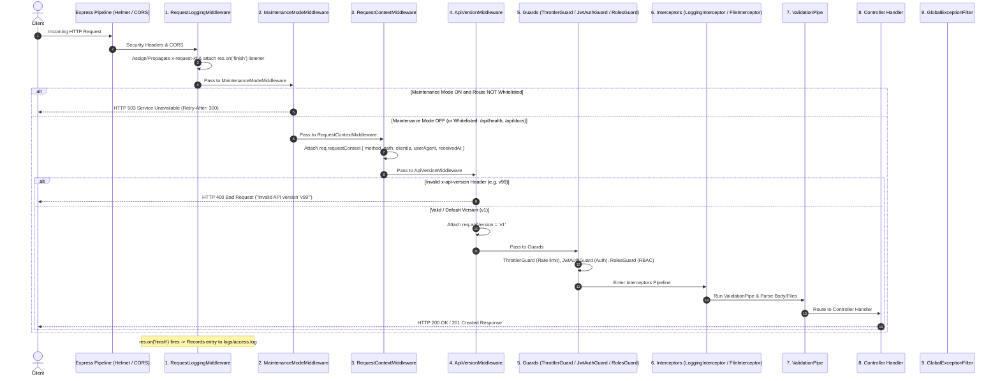

# Wavevents NestJS Backend — Middleware & Request Processing Architecture

This document provides documentation of the **Custom Middleware Layer** and complete request processing pipeline for the **Wavevents FDFED Application**.

---

## 1. Custom Middleware Inventory & Responsibilities

The custom middleware directory (`common/middleware/`) contains **EXACTLY** four focused custom middleware components:

```
common/middleware/
├── request-logging.middleware.ts
├── maintenance-mode.middleware.ts
├── request-context.middleware.ts
└── api-version.middleware.ts
```

> **Evaluation Clarification Statement:**  
> *"These are our custom middleware implementations. Other FDFED requirements are implemented using NestJS's dedicated mechanisms such as Guards, Interceptors, Pipes, and Exception Filters."*

---

### A. `RequestLoggingMiddleware`
- **File:** [`request-logging.middleware.ts`](file:///d:/Event%20Management%20Project/React%20+%20Nestjs/backend/src-nestjs/common/middleware/request-logging.middleware.ts)
- **Purpose:** Centralized HTTP request metric logging, correlation ID generation, and credential sanitization.
- **Real-World Use Case:** Ensures every incoming HTTP request receives a unique `x-request-id` header/property, measures end-to-end execution duration, masks sensitive parameters (`password`, `token`, `jwt`), and records access metrics to `logs/access.log`.
- **Scope:** Global (`.forRoutes('*')` in `AppModule`).
- **Registration Order:** 1st in middleware chain.
- **What It Does:**
  - Assigns or propagates `req.id` (`x-request-id`).
  - Sanitizes URLs for logging.
  - Registers `res.on('finish')` listener to capture status code and duration.
  - Appends metric lines to `logs/access.log`.
- **What It Deliberately Does NOT Do:**
  - Does NOT block requests.
  - Does NOT authenticate or authorize users.
  - Does NOT validate DTO payloads.
  - Does NOT modify business request bodies.
- **Why No Duplication:** Primary owner of request metric logging and `x-request-id` generation. No other component duplicates this role.

---

### B. `MaintenanceModeMiddleware`
- **File:** [`maintenance-mode.middleware.ts`](file:///d:/Event%20Management%20Project/React%20+%20Nestjs/backend/src-nestjs/common/middleware/maintenance-mode.middleware.ts)
- **Purpose:** System availability management and maintenance mode short-circuiting.
- **Real-World Use Case:** Allows administrators to put the application into maintenance mode (`MAINTENANCE_MODE=true`) during database migrations or system upgrades without shutting down the server process, while leaving health checks and documentation accessible.
- **Scope:** Global (`.forRoutes('*')` in `AppModule`).
- **Registration Order:** 2nd in middleware chain.
- **What It Does:**
  - Checks `MAINTENANCE_MODE` env flag (default: `false`).
  - Bypasses whitelisted operational routes (`/api/health`, `/api/docs`, `/api/docs-json`).
  - Short-circuits non-whitelisted requests with `503 Service Unavailable`, `Retry-After: 300` header, and structured JSON containing `requestId`.
- **What It Deliberately Does NOT Do:**
  - Does NOT authenticate or perform RBAC.
  - Does NOT write log files independently.
  - Does NOT throw application exceptions.
  - Does NOT perform rate limiting.
- **Why No Duplication:** Transport-level availability control. Operates before Guards and Controllers.

---

### C. `RequestContextMiddleware`
- **File:** [`request-context.middleware.ts`](file:///d:/Event%20Management%20Project/React%20+%20Nestjs/backend/src-nestjs/common/middleware/request-context.middleware.ts)
- **Purpose:** Creates a standardized application-level request context for downstream components.
- **Real-World Use Case:** Provides downstream controllers, services, and interceptors with a normalized, immutable `req.requestContext` snapshot of transport metadata (HTTP method, clean path, client IP, user agent, timestamp).
- **Scope:** Global (`.forRoutes('*')` in `AppModule`).
- **Registration Order:** 3rd in middleware chain.
- **What It Does:**
  - Normalizes transport metadata into a structured `RequestContext` object:
    ```typescript
    req.requestContext = {
      method: string,
      path: string,
      clientIp: string,
      userAgent: string,
      receivedAt: string,
    }
    ```
  - Attaches `req.requestContext` to the Express request object.
- **What It Deliberately Does NOT Do:**
  - Does NOT generate request IDs (owned by `RequestLoggingMiddleware`).
  - Does NOT write logs or compute durations.
  - Does NOT authenticate or authorize users.
  - Does NOT validate DTO payloads.
- **Why No Duplication:** Distinct responsibility of creating a normalized `req.requestContext` data structure for application components without logging or side-effects.

---

### D. `ApiVersionMiddleware`
- **File:** [`api-version.middleware.ts`](file:///d:/Event%20Management%20Project/React%20+%20Nestjs/backend/src-nestjs/common/middleware/api-version.middleware.ts)
- **Purpose:** Establishes API version awareness for future backend evolution.
- **Real-World Use Case:** Inspects incoming `x-api-version` headers (`v1`, `v2`). Defaults to `v1` when omitted, guaranteeing 100% backward compatibility for existing frontend calls (`/api/events`, `/api/tickets`, etc.). Returns `400 Bad Request` if an unsupported version (e.g. `v99`) is requested.
- **Scope:** Global (`.forRoutes('*')` in `AppModule`).
- **Registration Order:** 4th in middleware chain.
- **What It Does:**
  - Normalizes requested API version.
  - Validates version against supported set (`v1`, `v2`).
  - Defaults to `req.apiVersion = 'v1'` when header is absent.
  - Rejects unsupported versions with structured `400 Bad Request` JSON.
- **What It Deliberately Does NOT Do:**
  - Does NOT rewrite request URLs or break existing `/api/...` contracts.
  - Does NOT authenticate or perform RBAC.
  - Does NOT write log files independently.
- **Why No Duplication:** Provides transport-level version resolution without modifying routes or competing with framework mechanisms.

---

## 2. Complete Request Processing Chain



---

## 3. NestJS Dedicated Mechanisms Used for Other Responsibilities

To avoid duplicate functionality, the remaining requirements are handled by dedicated NestJS architecture components:

| Responsibility Area | Framework Mechanism | File Location |
|---|---|---|
| **Authentication** | `JwtAuthGuard` | [`common/guards/jwt-auth.guard.ts`](file:///d:/Event%20Management%20Project/React%20+%20Nestjs/backend/src-nestjs/common/guards/jwt-auth.guard.ts) |
| **RBAC Authorization** | `RolesGuard` & `HeaderRoleGuard` | [`common/guards/roles.guard.ts`](file:///d:/Event%20Management%20Project/React%20+%20Nestjs/backend/src-nestjs/common/guards/roles.guard.ts) |
| **Rate Limiting** | `ThrottlerGuard` | [`app.module.ts`](file:///d:/Event%20Management%20Project/React%20+%20Nestjs/backend/src-nestjs/app.module.ts) (`APP_GUARD`) |
| **File Upload Parsing** | `FileInterceptor` | [`modules/uploads/uploads.controller.ts`](file:///d:/Event%20Management%20Project/React%20+%20Nestjs/backend/src-nestjs/modules/uploads/uploads.controller.ts) |
| **DTO Payload Validation** | `ValidationPipe` | [`main.ts`](file:///d:/Event%20Management%20Project/React%20+%20Nestjs/backend/src-nestjs/main.ts#L49) |
| **Centralized Error Handling** | `GlobalExceptionFilter` | [`common/filters/global-exception.filter.ts`](file:///d:/Event%20Management%20Project/React%20+%20Nestjs/backend/src-nestjs/common/filters/global-exception.filter.ts) |
| **HTTP & Browser Security** | `helmet` & `cors` | [`main.ts`](file:///d:/Event%20Management%20Project/React%20+%20Nestjs/backend/src-nestjs/main.ts#L27) |
| **Periodic Log Archival** | `LogRotationService` | [`common/logging/log-rotation.service.ts`](file:///d:/Event%20Management%20Project/React%20+%20Nestjs/backend/src-nestjs/common/logging/log-rotation.service.ts) |
